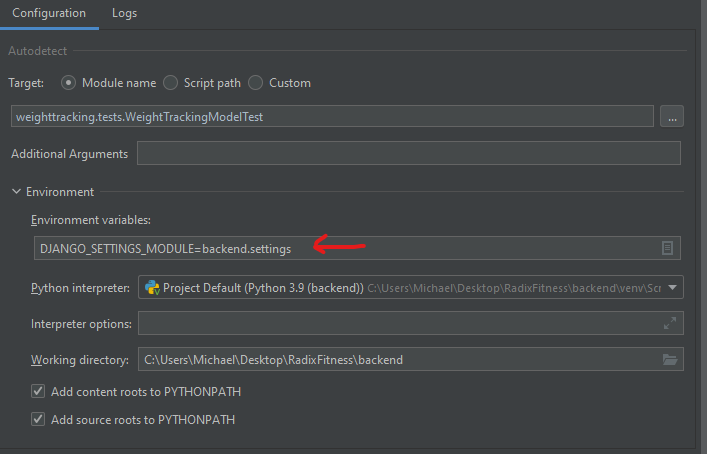

# Contribution

Starting a new project requires the command,

```console
django-admin startproject backend
```

This command generates a skeletal framework with crucial configurations. The main files are,

```
backend/                 <-- Generated
├── manage.py
├── backend/
│   ├── __init__.py
│   ├── asgi.py
│   ├─ settings.py
│   ├─ urls.py
│   ├── wsgi.py
```

However, this is already done and only needed to be executed once. This is the project, and is under the directory
called `backend` in our environment.

- **manage.py -** Contains various Django management commands. It's the tool through which you initiate
 the development server, create applications, run migrations, and more.
- **backend/settings.py -** Contains the settings that configure your project, from database configurations to 
 middleware lists. This is where you define how your application functions.
- **backend/urls.py -** The URL dispatcher, encoded within `urls.py` maps URLs to Views. This file determines which 
 view is displayed when a specific URL is accessed.
- **backend/wsgi.py -** Short for Web Server Gateway Interface, `wsgi.py` serves as the entry point for your application when deployed
 on a production server. It's the bridge connecting your application to the web server, enabling it to handle incoming requests.
- **backend/asgi.py -** Similar to `wsgi.py`, `asgi.py` is the entry point for asynchronous web servers. It stands for  Asynchronous
 Server Gateway Interface and facilitates the handling of asynchronous HTTP requests.

For each project, there are many applications. The main project here is `backend` and will not require anymore
to be created. Contribution to the project will require creates of new `apps`. Here, A `project` refers to the entire 
application and all its parts. An `app` refers to a submodule of the project. It's self-sufficient and not intertwined 
with the other `apps` in the project such that, in theory, you could pick it up and plop it down into another project 
without any modification. An app typically has its own `models.py` (which might actually be empty). You might think of
it as a standalone python module. A simple project might only have one app.

We create a new `app` with the following command,

```
python manage.py startapp <my_app>
```

The two commands will generate,

```
my_project/
├── manage.py
├── my_project/
│   ├── __init__.py
│   ├── asgi.py
│   ├─ settings.py
│   ├─ urls.py
│   ├── wsgi.py
├── my_app/                 <-- Generated
    ├── migrations/
    │   └── __init__.py
    ├── __init__.py
    ├── admin.py
    ├── apps.py
    ├── models.py
    ├── tests.py
    ├── urls.py
    └── views.py
```

The follows files generated,

- **models.py -** At the heart of every application lies the `models.py` file. This is where you define the data structures
 using Djangos ORM (Object-Relational Mapping). Each model class represents a table in the database. This file forms the 
 foundation of your application's data management.
- **views.py -** The `views.py` file encapsulates the logic that defines how your application interacts with user's requests.
 Views handle data processing, rendering templates and responding to actions. This file transforms user interactions into
 tangible responses.
- **tests.py -** Test-driven development gains momentum through the `tests.py` file. Here, you write unit tests to ensure
 your application's components function as expected.
- **admin.py -** The `admin.py` file isn't just for administrators - it configures how your application's models are
 presented in Djangos admin interface. This file allows administrators to manage data seamlessly.
- **migrations -** This directory is a blueprint of all changes in your application models.
- **Other files -** Additional files might surface based on your applicants needs. For example, `forms.py` houses form classes
 for data input, `urls.py` maps URLs to Views. `apps.py` manages application-specific configurations. `serializers.py` serves the 
 purpose of transforming the database data into a datatype that javascript can use.

Creating a new `app` will require it to be added to the projects `INSTALLED_APPS`,

```Python
INSTALLED_APPS = [
    'my_app',
    ...
]
```

The `django-rest-framework` introduces a new file called `serializers.py`, this is not added by default when creating a 
new `app`. The first thing we need to get started on our Web API is to provide a way of serializing and deserializing 
the `app` instances into representations such as `json`. We can do this by declaring serializers that work very similar 
to Django's forms. A serializer is what determines that information that is being sent back for each request.

# Database Changes

[Migrations](https://docs.djangoproject.com/en/5.0/topics/migrations/#top) are Django’s way of propagating changes you 
make to your models (adding a field, deleting a model, etc.) into your database schema. They’re designed to be mostly 
automatic, but you’ll need to know when to make migrations, when to 
run them, and the common problems you might run into.

There are several commands which you will use to interact with migrations and Django’s handling of database schema:

1. `makemigrations`, which is responsible for creating new migrations based on the changes you have made to your models.
2. `migrate`, which is responsible for applying and unapplying migrations.
3. `sqlmigrate`, which displays the SQL statements for a migration.
4. `showmigrations`, which lists a project’s migrations and their status.

You should think of migrations as a version control system for your database schema. `makemigrations` is responsible 
for packaging up your model changes into individual migration files - analogous to commits - and `migrate` is responsible 
for applying those to your database.

Let's take an example, suppose our current model for `UserProfile` is,

```Python
class UserProfile(models.Model):
    uid = models.TextField()

    ...
```

and we (in the future) wanted to add another field, `name` to become,

```
class UserProfile(models.Model):
    uid = models.TextField()
    name = models.TextField()

    def __str__(self):
        return self.name

```

To commit these changes to the database, the two commands need to be ran.

```commandline
python manage.py makemigrations
python manage.py migrate
```

# Administration

To run as administrator, traverse to `http://localhost:8000/admin/`. A superuser has been created with username and 
password as `admin`. This will allow to edit the database and act as god.

# Tests

When executing tests we need to keep Django happy

```Python
import django

django.setup()
```

and also get the appropriate environment variable as the following in PyCharm,



# Test structure

Test cases will typically have a format such as this,

```python
class YourTestClass(TestCase):
    def setUp(self):
        # Setup run before every test method.
        pass

    def tearDown(self):
        # Clean up run after every test method.
        pass
    
    @classmethod
    def setUpTestData(cls):
        # Will be only ran once, to create reusable test data.
        pass

    def test_something_that_will_pass(self):
        self.assertFalse(False)

    def test_something_that_will_fail(self):
        self.assertTrue(False)

```

# Running all tests

To execute all tests, the following command can be used.

```commandline
python manage.py test
```

This will discover all files named with the pattern test*.py under the current directory and run all tests defined 
using appropriate base classes.

If your tests are independent, on a multiprocessor machine you can significantly speed them up by running them in 
parallel. The use of --parallel auto below runs one test process per available core. The auto is optional, and you can 
also specify a particular number of cores to use.

## Speeding up test execution time.

```commandline
python manage.py test --parallel auto
```

## Running an individual test

If you want to run a subset of your tests you can do so by specifying the full dot path to the package(s), module,
`TestCase` subclass or method, e.g.

```commandline
# Run all tests inside the tests file 
python manage.py test weighttracking.tests.test_models

# Run all tests for the given class
python manage.py test weighttracking.tests.test_models.WeightTrackingModelTest

# Run a specific test inside the class
python manage.py test weighttracking.tests.test_models.WeightTrackingModelTest.test_weight_tracking_model_creation
```

# Test structure

The generated app will provide a `tests.py`, however, I much prefer to change the structure to the following,

```commandline
app_example/
  /tests/
    __init__.py
    test_models.py
    test_views.py
```

In order to not bloat the single file with every test type.

# Code Style

Black and isort are Python formatting tools that will are ran over the repository. Once a pull request has been made the
GitHub Action workflow will run to make sure the code is an acceptable format before it can be merged. Any subsequent
commits will also rerun the tests.

Due to the repository size, it's completely acceptable to resolve any formatting problems by running the scripts to 
format the code over the entire repository. 

To resolve all formatting issues, simply run `format_code.cmd` within the `app` directory.

# API Documentation

API documentation is done by using `drf-yasg` and is accessible using `http://.../swagger/`.