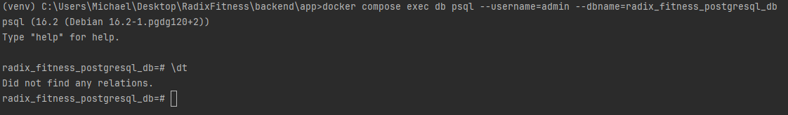
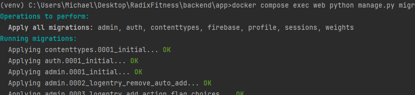
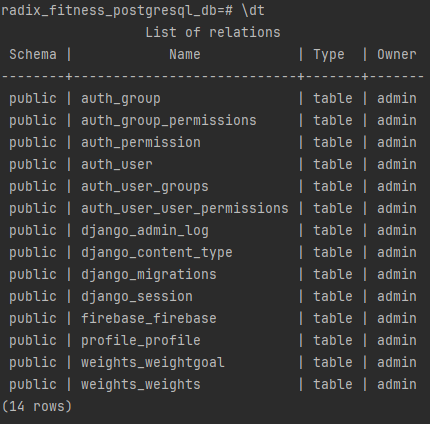

# Start the Server

Run the command,

```
python manage.py runserver
```

Ideally, have this configured in PyCharm.

Now’s a good time to note, don’t use this server in anything resembling a production environment. 
It’s intended only for use while developing. (Django is in the business of making web frameworks, not web servers.)

# Model Changes

When Models have been altered, you need to migrate the database. Then this is done from the following command,

```console
python manage.py makemigrations
python manage.py migrate
```

The server will need to be restarted after running these two commands.

# Architecture

Django is used as a backend, therefore we will primarily be using the [django-rest-framework](https://www.django-rest-framework.org/tutorial/quickstart/)
library to create a RESTful API, we will not be utilizing Django to return any HTML.

# Authorzation

As of now, we use Firebase for our account creation and management. The user is expected to send us a JWT(JSON Web Token)
when sending a request to our backend. To handle all requests and verify that the token prior to forwarding it
to our Views, I have created a Middleware class called `FirebaseTokenMiddleware`. This Middleware is responsible
for checking the authenticity of the token, parse it and then forward the user UID to our Views.

# Docker for Development

The `docker-compose.yaml` is responsible for setting up the PostgreSQL database, connecting our DRF application to the 
database and starting up the Nginx server to be hosted on port `1337`. When executing the docker compose for the
first time, there are some necessary steps to configure the database. Keep in mind this only needs to be done once,
per volume because the volume will have correctly configured the database setting which will be mounted to each
new container. This is found at,

```YAML
  db:
    image: postgres:16
    volumes:
      - postgres_data:/var/lib/postgresql/data/
  ...
```

#### 1. Change to the correct directory
The base directory is `backend` but the necessary development files are located inside of `app`. Therefore, change to 
the `app` directory by running `cd app`.

#### 2. Start up the containers

Docker compose is responsible for the initialization of all the necessary containers located inside the 
`docker-compose.yaml` file. The command for execute Docker compose is `docker compose up`.

#### 3. Initialize the Database

The initial state of our PostgreSQL database does not contain our user created tables. This can be visible by using
the follows commands,

First, from within the `db` container, run the `psql` executable with the following commands.

```commandline
docker compose exec db psql --username=admin --dbname=radix_fitness_postgresql_db
```

This command allows us to execute PostgresSQL commands through a CLI by connecting to the `radix_fitness_postgresql_db`
database logged in as admin. When connected we can see that there are currently no tables present in the database, shown
below.



In order to initialize the user tables, we need to run the following command,

```commandline
docker compose exec web python manage.py migrate
```

This command will be executed within the `web` container and tells Django to run all the migrations files located
in each app migrations folder. Running it for the first time will also create the tables.



Now, after running this command we can refresh the database and see the created tables.



#### 4. Create a superuser in order to use the adminstration page.

The next step is to create a superuser. This is required to authenticate to the admin page, which should now
be visible at `localhost:1337/admin`. To create a superuser, run the following command,

```commandline
docker compose exec web python manage.py createsuperuser
```

Using the newly created superuser account, we can authenticate and seeing the administration page. Because this is
a fresh volume, their will be no user data.

#### Additional development information

Each newly created images do not need to reinitialize the commands above. As long as they're mounted to the same
volume where the instructions were ran. This is shown by the database service,

```YAML
  db:
    image: postgres:16
    volumes:
      - postgres_data:/var/lib/postgresql/data/
```

Keep in mind, volume mounting only occurs during run-time and not build-time, i.e. for containers and not for images.
The same applies, new containers do not need to rerun these instructions as it will be mounted to the folder where
these instructions have already occurred, this is the same location where the PostgreSQL data is stored. Therefore,
only rerun the instructions for each new volume.
