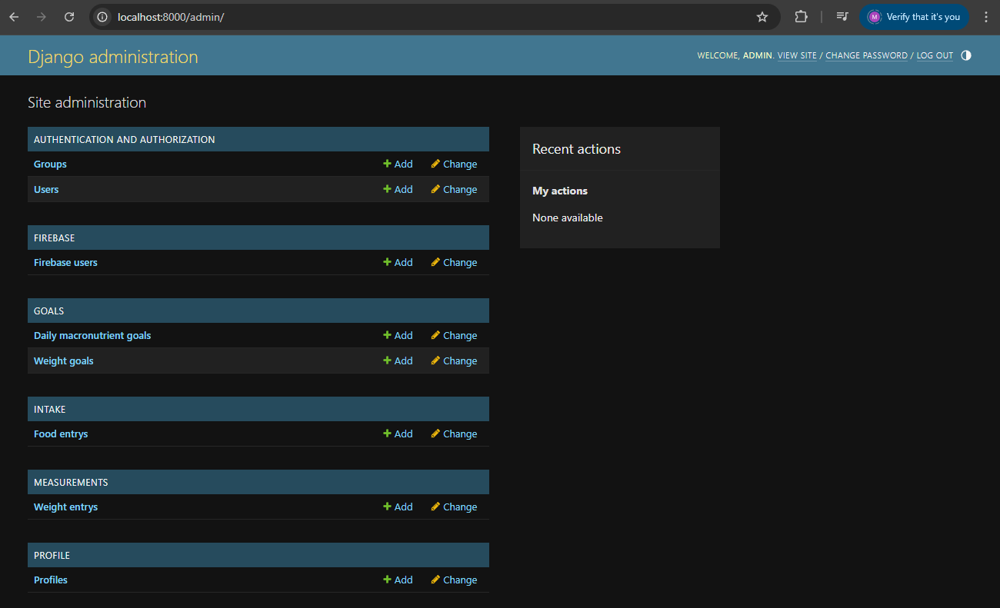

<div align="center">
    <h1> Administration </h1>
</div>

To run as administrator strictly for local development, traverse to `http://localhost:8000/admin/`.

Authentication to `/admin/` requires a Django superuser. For local development self-hosted data we can create an admin account. This is created by running,

```
python manage.py createsuperuser
```

This command will prompt you to enter the credentials for creating a superuser, allowing you to authenticate to the administration page and manually edit and view database entries.

<div align="center">
    
</div>