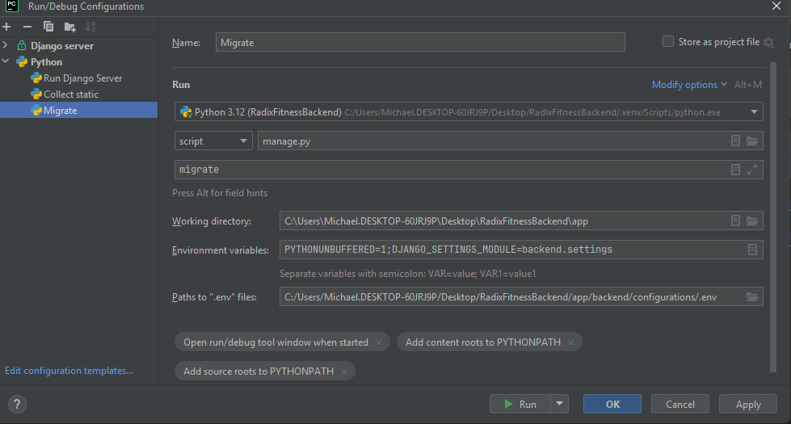

<div align="center">
    <h1> Database Changes </h1>
</div>

[Migrations](https://docs.djangoproject.com/en/5.0/topics/migrations/#top) are Django’s way of propagating changes you 
make to your models (adding a field, deleting a model, etc.) into your database schema. They’re designed to be mostly 
automatic, but you’ll need to know when to make migrations, when to 
run them, and the common problems you might run into.

There are several commands which you will use to interact with migrations and Django’s handling of database schema:

1. `makemigrations` - Responsible for creating new migrations based on the changes you have made to your models.
2. `migrate` - Responsible for applying and unapplying migrations.
3. `sqlmigrate` - Displays the SQL statements for a migration.
4. `showmigrations` - Lists a project’s migrations and their status.

You should think of migrations as a version control system for your database schema. `makemigrations` is responsible 
for packaging up your model changes into individual migration files - analogous to commits - and `migrate` is responsible 
for applying those to your database.

Let's take an example, suppose our current model for `UserProfile` is,

```Python
class UserProfile(models.Model):
    uid = models.TextField()

    ...
```

and we (in the future) wanted to add another field, `name` to become,

```python
class UserProfile(models.Model):
    uid = models.TextField()
    name = models.TextField()

    def __str__(self):
        return self.name
```

To commit these changes to the database, the two commands need to be ran.

```commandline
python manage.py makemigrations
python manage.py migrate
```

The database where the migrations will be applied to is the database located at the `DATABASE_URL` environment variable. This means we will need to run the `migrate` script with PyCharm to find the environment variable through the `.env` file.

<div align="center">
    
</div>