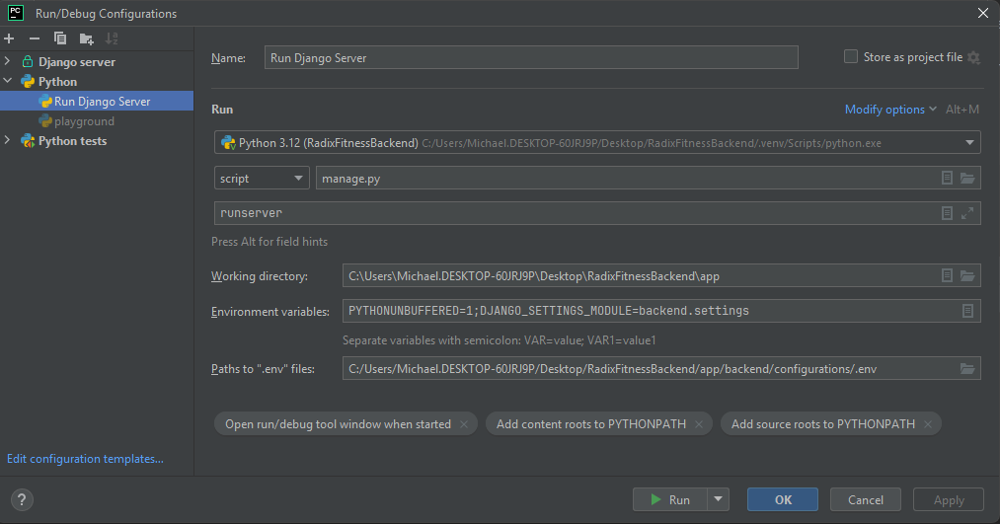

<div align="center">
    <h1> Development Setup </h1>
</div>

## 1. Virtual Environment

The current dependencies listed in `requirements.txt` only supports Python `3.12` and below. Wheels do not exist for all dependencies for Python versions greater than `3.12`. To begin development install [Python 3.12](https://www.python.org/downloads/release/python-31210/) and setup a virtual environment.

<div align="center">
    
</div>

## 2. PostgreSQL

The dependency `psycopg` requires the [installation of PostgreSQL](https://www.postgresql.org/download/windows/) on the machine. PostgreSQL needs to be installed before performing the `pip` installation.

## 3. Dependency Installation

Activate the previously created virtual environment in step one using the following command,

```python
python -m pip install -r requirements.txt
```

## 4. Server Setup

The server should ideally be configured and launched using Docker, illustrated further below. However, a quick SQLite3 instance be
spun up quickly as shown below using the "Django Server" configuration in PyCharm.

<div align="center">
    
</div>

## 5. Environment Variables

### Defaults

The `defaults.ini` file is used for as a default when no `.env` file is used. This will allow for a small SQLite3 database to be used and disables the use of Firebase. This is primarily used to allow for the execution of unit tests without running a larger PostgreSQL database.

When running tests we do not want to connect to our database server. Instead, we want to run tests locally using SQLite3. This is because SQLite3 is acceptable for local development using low amounts of user data. This is ideal as it allows us to run 
our tests without requiring a database server to be running as SQLite3 will create a 
local database using the `db.sqlite3` file.

Our Django configuration parser will default to using SQLite3. This is ideal for local development, running Docker locally and also using GitHub Actions. Environment variables will be configured when connecting to a database server.

### Local Server

A local development server can be run by retrieving the `.env` file that contains the secrets. This will set the environment variables and thus cause `DjangoConfigParser` to use the environment variables defined within the `.env` file instead of the defaults defined inside of `defaults.ini`. The `.env` file contains the secrets and sufficient environment variables to run a server locally. The file path needs to be set into PyCharms `Paths to ".env" files:`.

<div align="center">
 
</div>

<div align="center">
 
</div>

### Remote Server

When executing the server remotely, the environment variables will be injected. Here, GitHub action secrets is configured to allow for environment variables to be set while keeping them hidden.

<div align="center">
 
</div>

## 6. PYTHONPATH

The method `setup_python_path` is responsible for modifying `PYTHONPATH` by adding additional addition directories where Python will search for imports. These are added during runtime that allow for it to work at runtime, however, PyCharm is not aware
of these locations in the IDE. As a result, despite the code running correctly we will get red underlines in PyCharm, indicating that the module should not import.

<div align="center">
    
</div>

In PyCharm, add the necessary directories within `setup_python_path` as follows.

<div align="center">
    
</div>

The red underlines should now be resolved as PyCharm has now marked the `backend` directory as a source path.

## 7. Django Settings

Django settings needs to be properly configured in order to run tests and make sure the Django can find the settings file. Within PyCharm, `Language & Frameworks → Django -> Settings:` and select the `settings.py` file located at `app/backend/settings.py`.

<div align="center">
    
</div>

## 8. Automatic Code Formatting

The script `format_code.cmd` will automatically activate the local virtual environment in order to run the correct `python` interpreter with `black` and `isort` as dependencies. For now, this runs over the entire repository, but due to the current small size, it is currently acceptable. 

To configure this to run automatically when saving, PyCharm allows for the `File Watchers` to be configured shown below.

<div align="center">
    
</div>
