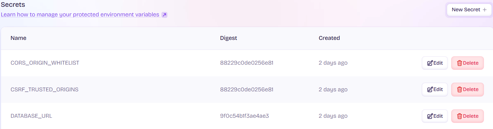

<div align="center">
    <h1> Django API Hosting Using Fly.io </h1>
</div>

Fly.io is a global application runtime platform designed to run containers close to users. It allows developers to deploy full-stack applications (including API servers) globally, using Docker containers with minimal configuration.

In the context of Radix Fitness Django application,

- **Fly.io acts as the public entry point** for all HTTPS requests to the backend API.
- It accepts incoming HTTP traffic, automatically routes it to an internal port in the deployed Docker container.
- Inside the container, requests are served by Gunicorn, a WSGI-compliant HTTP server.
- Gunicorn forwards the request to Djangos WSGI interface (`backend.wsgi:application`), which then routes it to the appropriate Django view via middleware, URLs and the Django request lifecycle.

Thus, Fly.io replaces the traditional role of Nginx or Apache in a typical production stack. It receives HTTP packets and communicates directly with the Django WSGI application through the containerized Gunicorn process.

## Role of Fly.io

Fly.io serves as the API gateway and runtime platform for Radix Fitness backend. Its key responsibilities include,

- Listening on port 443/80 and forwarding traffic to the containers internal `PORT` (8000).
- Injecting environment variables securely into the container.
- Running the containerized Gunicorn server.
- Providing health checks and automated restarts of crashed instances.
- Executing **release commands** to apply database migrations during deploys.
- Acting as the middle layer between client and backend, forwarding requests to Django, reading/writing from the database and returning responses.

In this way, Fly.io becomes the gateway through which all data flows. It receives external traffic, passes it into the WSGI app and returns structured HTTP responses to the user.

## Public Endpoint and Frontend Integration

Once the Fly.io Django API has been deployed, it is assigned a **public domain**.

```
https://radix-fitness-api.fly.dev
```

This domain becomes the **external API endpoint** for the frontend application. Inside of Radix Fitness frontend (Which is hosted separately by Vercel), this is configured via the environment variable.

```
VITE_API_END_POINT=https://radix-fitness-api.fly.dev
```

From the browser, **the frontend sends HTTP requests to this domain**, and Fly.io ensures those packets are routed to the running Django container where Gunicorn handles them. This design makes Fly.io an effective replacement for Nginx as the HTTP interface for the Django application.

## Secret Management

Fly.io supports secure environment variable injection during deployment. These variables are never stored in the Git repository and are instead defined using.

```bash
fly secrets set DATABASE_URL=<your_neon_url>
```

Alternatively it can be set in the web page UI.

<div align="center">
    
</div>

## Cross-Origin and Host Configuration

When exposing APIs across different origins such as the Vercel frontend calling Fly.io API, it's essential to configure `CORS`, `CSRF` and `ALLOWED_HOSTS` correctly.

#### `CORS_ORIGIN_WHITELIST`

CORS (Cross-Origin Resource Sharing) is a browser security feature that blocks JavaScript from accessing responses from a different origin unless the server explicitly allows it. When a browser detects a cross-origin request (i.e. different protocol, domain or port), it adds an `Origin` header. The server must respond with a matching `Access-Control-Allow_origin` header. If not, the browser blocks access to the response.

To configure CORS in Radix Fitness, you set the environment variable `CORS_ORIGIN_WHITELIST` which configures the django constant `CORS_ORIGIN_WHITELIST`. This allows you to control wich frontend origins are permitted.

```
CORS_ORIGIN_WHITELIST = django_configs.get("Django", "CORS_ORIGIN_WHITELIST").split(",")
```

CORS is enforced by browsers to protect users from unauthorized cross-origin access. Django uses `CORS_ORIGIN_WHITELIST` to explicitly allow trusted frontend origins.

The current value of `CORS_ORIGIN_WHITELIST` is set to the Radix Fitness frontend `https://radix-fitness-frontend.vercel.app/` which is hosted on Vercel. This allows our frontend to connect to the API. For local development this can be set to listen to the Vite hosting domain. Without this, browsers will block requests due to same-origin policy restrictions.

```python
CORS_ORIGIN_WHITELIST=http://localhost:5173,http://localhost:8000
```

#### `CSRF_TRUSTED_ORIGINS`

CSRF (Cross-Site Request Forgery) is a security vulnerability where a malicious site tricks a user’s browser into performing actions (like form submissions or API requests) on another site where the user is authenticated — without their knowledge.

Browsers automatically include cookies (like `sessionid`) with every request, even when that request is triggered by a different site. If the server doesn't verify where the request came from, an attacker can exploit this by crafting hidden forms or AJAX calls from another site.

Django attempts to mitigate this by verifying that the request comes from a trusted origin. Therefore, this value is set to the frontend domain as well, i.e. it will have the exact same environment variable as `CORS_ORIGIN_WHITELIST`. This is set identically using environment variables.

```python
CSRF_TRUSTED_ORIGINS = django_configs.get("Django", "CSRF_TRUSTED_ORIGINS").split(",")
```

CSRF protection ensures that state-changing requests (like form submissions) are intentional and not forged by a third-party site. Django defends against it using CSRF tokens and trusted origin checks. You can control which origins are trusted using `CSRF_TRUSTED_ORIGINS`.

#### `DJANGO_ALLOWED_HOSTS`

`ALLOWED_HOSTS` is a Django security setting that defines a list of hostnames (domains or IPs) your app is allowed to serve. It protects your site against **HTTP Host header attacks**, where an attacker sends requests with a fake Host header to try to exploit routing or caching issues.

When you make a request to a website, your browser includes the `Host` header to tell the server which domain you're accessing.

```HTTP
GET / HTTP/1.1
Host: www.myapp.com
```

In a shared hosting environment or reverse proxy (like Nginx), multiple domains can be served from the same server IP, so the server must trust the Host header to route requests correctly.

Django checks the `Host` header of every request. If the host is not in `ALLOWED_HOSTS`, it immediately blocks the request. Therefore, the environment variable that sets `ALLOWED_HOSTS` is configured to be the API domain hosted by Fly.io, currently `https://radix-fitness-api.fly.dev`.

## Fly.io Configuration With `fly.toml`

```toml
app = 'radix-fitness-api'
primary_region = 'syd'
console_command = '/code/manage.py shell'
```

- `app` - The name of the deployed app on Fly.io
- `primary_region` - Preferred deployment region.
- `console_command` - Command used when opening Fly.io shell session.

```toml
[deploy]
  release_command = 'python manage.py migrate --noinput'
```

- `release_command` - Runs during every deployment **before** the app is started. In this case, it applies Django database migrations. This is why the Neon database get tables populated. It was the result of this `migrate` command running automatically. On first deploy this creates the database tables. On every deploy, this applies any new schema changes from Django migrations.

```toml
[env]
  PORT = '8000'
```

- This sets the internal port used by Gunicorn. Fly.io maps external traffic to this.

```toml
[http_service]
  internal_port = 8000
  force_https = true
  auto_stop_machines = 'stop'
  auto_start_machines = true
  min_machines_running = 0
  processes = ['app']
```

- `internal_port` - The port inside the container that Fly forwards traffic to.
- `force_https` - Redirected HTTP traffic to HTTPS.
- `auto_start_machines` / `auto_stop_machines` - Used for scale-to-zero functionality.
- `processes` - Named process group if you scale by role.

```toml
[[vm]]
  memory = '512mb'
  cpu_kind = 'shared'
  cpus = 1
```

- Configures VM resources per instance.

```toml
[[statics]]
  guest_path = '/code/static'
  url_prefix = '/static/'
```

- Serves static files directly via Fly.ios build-in HTTP service. The Docker command,

```Docker
RUN python manage.py collectstatic --noinput
```

generates the static resources and puts them into `static`.

## Docker and Gunicorn Hosting

The Dockerfile serves as the entrance point for setupping up the environment.

```Docker
FROM python:3.12-slim

ENV PYTHONDONTWRITEBYTECODE 1
ENV PYTHONUNBUFFERED 1

WORKDIR app
COPY . .
EXPOSE 8000

RUN pip install -r requirements.txt
RUN python manage.py collectstatic --noinput

CMD ["gunicorn", "backend.wsgi:application", "--bind", "0.0.0.0:8000"]
```

Some key steps include,

- `WORKDIR` - Sets the working directory to `app`.
- `COPY` - Copes the source code into the image.
- `RUN` - Installs the project dependencies.
- `RUN` - Collects static files into `/static` which is later served by Fly.io
- `CMD` - Starts Gunicorn, which loads the Django WSGI application `backend.wsgi:application` and binds to `0.0.0.0:8000` matching Fly.io's expected port.

This setup means you do not need Nginx. Gunicorn is a production-grade WSGI server that listens directly for HTTP packets on port 8000, and Fly.io forwards requests to it without needing a proxy.

When a process binds to `0.0.0.0` it means "Listen to incoming connections on all available network interfaces on this machine". This includes,

- `localhost`
- Your network IP, e.g. `192.168.1.5`
- Docker bridge interfaces, e.g. `172.17.0.1`
- External IPs if not firewalled.

When you run the Django application inside a Docker container, the internel network has its own interfaces. If we were to use `--bind 127.0.0.1:8000` it would result in,

- Gunicorn would only listen on the loopback interface inside the container.
- Fly.io's proxy (which connects from outside the container) would **not be able to reach the Gunicorn server**.
- You would get connection refused errors.

But by binding to `--bind 0.0.0.0:8000`,

- Gunicorn accepts connections from any source, including external Fly.io load balancer/router.
- Is reachable from outside the container (Within the security restrictions of Fly.io networking).

You must bind to `0.0.0.0` so Fly can forward external HTTP traffic to your Gunicorn process inside the container.

## Request Lifecycle

#### 1. Client Sends HTTP Request

A user browser or frontend application executes,

```HTTP
GET https://radix-fitness-api.fly.dev/api/weight_entry
```

This means,

- **Method** - `GET`.
- **Path** - `/api/weight_entry`.
- **Host** - The subdomain is `radix-fitness-api`. The domain is `fly.dev`.
- The browser must resolve this domain to an IP address before making the request.

#### 2. DNS Resolution of the Domain Name

Before the browser can send the request, it must resolve

```
radix-fitness-api.fly.dev → ? → IP address
```

The DNS lookup flow will be,

1. DNS Resolver (e.g. Google DNS `8.8.8.8` or your ISP) receives the request.
2. It queries the `.dev` top-level domain, then finds the `fly.dev` DNS records.
3. Fly.io operates an authoritative nameserver for all its app subdomains.
4. It returns an Anycast IP address that routes to a nearby Fly.io edge node.

```
radix-fitness-api.fly.dev → 213.188.212.205  (example IP)
```

This IP is not the IP of the Docker container. It's the IP of a Fly.io **regional load balancer** or edge proxy, closest to the user geographically.

#### 3. Fly.io Edge Node Accepts the Request

The browser sends the full HTTP request to,

```
https://213.188.212.205
Host: radix-fitness-api.fly.dev
```

Then, Fly.io terminates the TLS/SSL connection at its edge node. It reads the Host header to determine which application this is for.

```
Host: radix-fitness-api.fly.dev → App: radix-fitness-api
```

It now knows which Fly app this request belongs to and which region to route to based on the `fly.toml` file.

#### 4. Routing to the Docker Container

Fly launches a Firecracker microVM (essentially a lightweight VM running the Docker image) with a private network inside their data center. This microVM has,

1. A container running the Gunicorn server.
2. A network bridge connected to the edge node.
3. Port `8000` open internally, via the `fly.toml` configurations.

```ini
[http_service]
  internal_port = 8000
```

Flys routing layer proxies the request to the internal IP of the VM running the app. That internal VM might have an address such as,

```
172.19.0.3:8000
```

This isn't exposed to the public, but Fly.io maintains an internal mapping of,

```
radix-fitness-api.fly.dev → [Active machine IP] → [Port]
```

There is no additional DNS lookup here, the routing is handled by Fly.io's service mesh and internal network.

```
1. Browser → DNS → Fly.io Anycast IP
2. Fly Edge Node → Finds app by Host header
3. Fly routes to VM (fdaa::25:3:8000) - Fly internal app mappings use IPv6
4. Gunicorn → Django → Neon DB
5. Response → Fly → Browser
```

#### 5. Gunicorn Receives the Request

Inside the container, Gunicorn is listening to `0.0.0.0:8000`. This means Gunicorn accepts the request on any interface inside the container. The HTTP request is now entirely inside the Docker container. The full HTTP request object. Gunicorn is a WSGI server so it formats the request according to the WSGI specification and passes it to the Django application.
