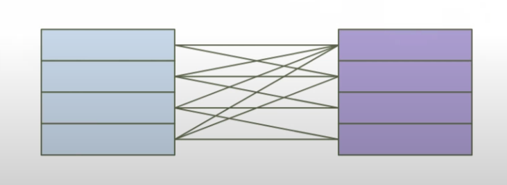
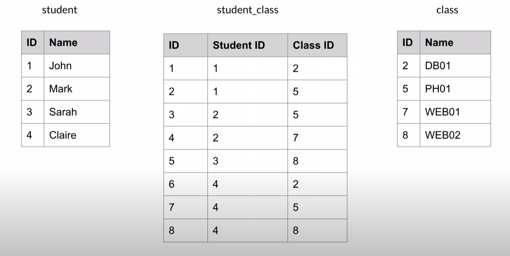

<div align="center">
    <h1> Relational Database Key Concepts - For Django </h1>
</div>

Relational databases organize data into structured tables composed of rows and columns. Each table models a specific entity and relationships between entities are established using constraints using foreign keys and unique constraints. Django, being an ORM (Object Relational Mapper) allows developers to interact with relational databases using Python classes and methods instead of raw SQL.

This documentation serves as a tutorial for understanding proper Django models. That is, understanding certain key concepts for relational databases, how they're represented in tables and created using standard SQL syntax must be understood before writing Django models. This serves as an educational documentation describing the crucial concepts of,

1. Primary Key
2. Foreign Key
3. Unique Constraint
4. One-to-One Relationship
5. One-to-Many Relationship
6. Many-to-Many Relationship
7. Indexes
8. Check Constraints
9. NULL vs NOT NULL
10. Default Values

When designing a Django application, developers **often define models using singular class names**. In contrast, raw SQL schemas typically use plural table names.

| Layer                      | Naming Convention         | Example         |
| -------------------------- |---------------------------| --------------- |
| **Django Model**           | Singular class name       | `Profile`       |
| **SQL Table (raw)**        | Plural table name         | `profiles`      |
| **Django Table (default)** | `<app_label>_<modelname>` | `myapp_profile` |

Django model class names **should be singular, representing a single row or entity**. SQL table names are commonly plural, representing collection of rows. Despite this naming difference, Django models and SQL tables are structurally equivalent.

<div align="center">
    <h1> Primary Keys </h1>
</div>

A **Primary Key** is a column or a combination of columns, **that uniquely identifies each row in a table**. The database uses the primary key **to index** and retrieve data efficiently. Primary keys enforce uniqueness and do not allow `NULL` values. They are essential for establishing relationships between tables.

In Django, each model automatically has an `id` field as the primary key unless explicitly overridden.

#### SQL Example

```SQL
CREATE TABLE users (
    id SERIAL PRIMARY KEY,
    username VARCHAR(50) NOT NULL
);
```

#### Table Visualization

```
+----+----------+
| id | username |
+----+----------+
| 1  | alice    |
| 2  | bob      |
+----+----------+
```

#### Example Query

```SQL
SELECT * FROM users WHERE id = 1;
```

#### Django Equivalent

```Python
from django.db import models

class User(models.Model):
    username = models.CharField(max_length=50)
```

<div align="center">
    <h1> Foreign Key </h1>
</div>

A Foreign Key is a column or group of columns in one table **that refers to the primary key in another table**. Foreign keys enforce referential integrity by ensuring that the target key exists in the referenced table. This enables structured relationships between entities, such as associating blog post with its author. A foreign key can also be a primary key in a table.

In Django, foreign keys are created using `model.ForeignKey` and you must specify the behaviour when the referenced object is deleted, e.g. `on_delete=models.CASCADE`.

```python
from django.db import models

class User(models.Model):
    username = models.CharField(max_length=100)

class Profile(models.Model):
    user = models.OneToOneField(User, on_delete=models.CASCADE, primary_key=True)
    bio = models.TextField()
```

In Djangos ORM, `ForeignKey` and `OneToOneField` are used to define relationships between models. By Default, **these relationships reference the primary key** of the target model unless explicitly told otherwise using the `to_field` argument. When a `ForeignKey` is defined without specifying the `to_field` parameter, Django implcitly uses the primary key of the related model as the target column.

```python
class Profile(models.Model):
    user = models.ForeignKey(User, on_delete=models.CASCADE)
```

Is therefore equivalent to,

```python
class Profile(models.Model):
    user = models.ForeignKey(User, to_field='id', on_delete=models.CASCADE)
```

If a non-primary but unique field in the target model should be referenced, the `to_field` argument must be explicitly set and the **target field must be unique**.

```python
class User(models.Model):
    email = models.EmailField(unique=True)

class Profile(models.Model):
    user = models.ForeignKey(User, to_field='email', on_delete=models.CASCADE)
```

#### SQL Example

```sql
CREATE TABLE posts (
    id SERIAL PRIMARY KEY,
    title VARCHAR(100),
    user_id INTEGER REFERENCES users(id)
);
```

#### Table Visualization

```
users:
+----+----------+
| id | username |
+----+----------+
| 1  | alice    |
| 2  | bob      |
+----+----------+

posts:
+----+-------------+---------+
| id | title       | user_id |
+----+-------------+---------+
| 1  | Hello World | 1       |
+----+-------------+---------+
```

#### Example Query

```sql
SELECT posts.title, users.username
FROM posts
JOIN users ON posts.user_id = users.id;
```

#### Django Equivalent

```python
class Post(models.Model):
    title = models.CharField(max_length=100)
    user = models.ForeignKey(User, on_delete=models.CASCADE)
```

<div align="center">
    <h1> Unique Constraint </h1>
</div>

A Unique Constraint ensures that the values in a column or a group of columns is distinct across all rows in a table. This is used to prevent duplicate entries for fields such as email addresses, usernames or product SKUs.

In Django, this is declared using `unique=True` on a model field or by defining `unique_together` or `UniqueConstraint` inside the `Meta` class.

#### SQL Example

```sql
CREATE TABLE products (
    id SERIAL PRIMARY KEY,
    sku VARCHAR(20) UNIQUE
);
```

#### Table Visualization

```
+----+--------+
| id | sku    |
+----+--------+
| 1  | ABC123 |
| 2  | XYZ789 |
+----+--------+
```

#### Example Query

```sql
SELECT * FROM products WHERE sku = 'ABC123';
```

#### Django Equivalent

```python
class Product(models.Model):
    sku = models.CharField(max_length=20, unique=True)
```

<div align="center">
    <h1> One-to-One Relationship </h1>
</div>

A One-to-One relationship ensures that each row in Table `A` is related to at most one row in Table `B` and vice versa. This is commonly used to split optional or rarely used data into separate tables and such as user profile details.

In Django, `models.OneToOneField` is used to define such relationships, typically linking to the primary key of another model. `models.OneToOneField` is essentially a shortcut for `ForeignKey(SomeModel, on_delete=CASCADE, unique=True)` as the foreign key refers to a unique primary key on `SomeModel` and thus making our column unique will make it a One-to-One relationship.

#### SQL Example

```sql
CREATE TABLE profiles (
    id SERIAL PRIMARY KEY,
    user_id INTEGER UNIQUE REFERENCES users(id),
    bio TEXT
);
```

#### Table Visualization

```
users:
+----+----------+
| id | username |
+----+----------+
| 1  | alice    |
+----+----------+

profiles:
+----+---------+---------------+
| id | user_id | bio           |
+----+---------+---------------+
| 1  | 1       | Developer     |
+----+---------+---------------+
```

#### Example Query

```sql
SELECT users.username, profiles.bio
FROM users
JOIN profiles ON users.id = profiles.user_id;
```

#### Django Equivalent

```python
class Profile(models.Model):
    user = models.OneToOneField(User, on_delete=models.CASCADE)
    bio = models.TextField()
```

<div align="center">
    <h1> One-to-Many Relationship </h1>
</div>

A One-to-Many relationship is the most common type of relationship in relational databases. It occurs when a single record in one table can be associated with multiple records in another table. For example, a user can write many blog posts, but each post is written by one and only one user.

In SQL, this is typically modeled by placing a foreign key in the table pointing to the primary key of the related table. In Django, it is represented by using `ForeignKey` to create the relationship without using `unique=True`.

#### SQL Example

```sql
CREATE TABLE users (
    id SERIAL PRIMARY KEY,
    username VARCHAR(50) NOT NULL
);

CREATE TABLE posts (
    id SERIAL PRIMARY KEY,
    title VARCHAR(100),
    user_id INTEGER REFERENCES users(id)
);
```

#### Table Visualization

```
users:
+----+----------+
| id | username |
+----+----------+
| 1  | alice    |
+----+----------+

posts:
+----+---------------+---------+
| id | title         | user_id |
+----+---------------+---------+
| 1  | First Post     | 1      |
| 2  | Another Post   | 1      |
+----+---------------+---------+
```

#### Example Query

```sql
SELECT * FROM posts WHERE user_id = 1;
```

#### Django Equivalent

```python
class User(models.Model):
    username = models.CharField(max_length=50)

class Post(models.Model):
    title = models.CharField(max_length=100)
    user = models.ForeignKey(User, on_delete=models.CASCADE)
```

<div align="center">
    <h1> Many-to-Many Relationship </h1>
</div>

A Many-to-Many Relationship exists when multiple rows in one table relate to multiple rows in another. For instance, students can be enrolled in many classes while a class can have many students.


<div align="center"> 
    
</div>

**This is typically implemented with a junction table**. In the following example we create a `student_class` table which contains two columns `Student ID` and `Class ID`. These two columns are foreign keys which reference the primary key of the other table, i.e. `Student ID` references the primary key of the `Student` table. This is necessary as it allows us to tell which student is enrolled in which class. Ideally, rename the table to something more meaningful than `student_class` such as `Enrollment`.

<div align="center"> 
    
</div>

In Django, this is defined with `models.ManyToManyField`, **which automatically creates the necessary junction table** behind the scenes. You only need to define a junction table manually if you need to store extra fields in the relationship or want to customize constraints.

#### SQL Example

```sql
CREATE TABLE students (
    id SERIAL PRIMARY KEY,
    name VARCHAR(100)
);

CREATE TABLE courses (
    id SERIAL PRIMARY KEY,
    title VARCHAR(100)
);

CREATE TABLE enrollments (
    student_id INTEGER REFERENCES students(id),
    course_id INTEGER REFERENCES courses(id),
    PRIMARY KEY (student_id, course_id)
);
```

#### Table Visualization

```
students:
+----+---------+
| id | name    |
+----+---------+
| 1  | Alice   |
| 2  | Bob     |
+----+---------+

courses:
+----+----------------+
| id | title          |
+----+----------------+
| 1  | Math           |
| 2  | Computer Sci   |
+----+----------------+

enrollments:
+------------+-----------+
| student_id | course_id |
+------------+-----------+
| 1          | 1         |
| 1          | 2         |
| 2          | 1         |
+------------+-----------+
```

#### Example Query

```sql
SELECT s.name, c.title
FROM students s
JOIN enrollments e ON s.id = e.student_id
JOIN courses c ON e.course_id = c.id;
```

#### Django Equivalent

In Django, when you declare a `ManyToManyField` on one side of the relationship (e.g. on Student), Django automatically provides access to the reverse relationship on the other side (e.g. Course) — so you don’t need to declare it twice.

You should not define `M`anyToManyField` on both sides. Doing so would create two separate many-to-many relationships (i.e., two different junction tables), which is not the intended design.

```python
class Course(models.Model):
    title = models.CharField(max_length=100)

class Student(models.Model):
    name = models.CharField(max_length=100)
    courses = models.ManyToManyField(Course)  # Implicit junction table created automatically

math = Course.objects.create(title="Math") # Create a course

alice = Student.objects.create(name="Alice")  # Create a student 
alice.courses.add(math) # Django has inserted a row into the implicit junction table linking Alice and Math.
```
<div align="center">
    <h1> Indexes </h1>
</div>

Indexes are special database structures that improve the speed of data retrieval operations. They're especially useful on columns used frequently in `WHERE`, `ORDER`, `BY` and `JOIN` clauses. However, indexes come with trade-offs, they require additional disk space and slightly reduce write performance (inserts, updates and deletes) because the index must be updated as well.

Django provides two primary ways to add indexes,

1. `db_index=True` - Adds a basic index on a **single field** directly in the field definition.
2. `Meta.indexes` - Allows creation of **composite (multi-column)** indexes and more advanced configurations.

#### SQL Example

```sql
-- Single-column index
CREATE INDEX idx_username ON users(username);

-- Composite index
CREATE INDEX idx_user_date ON daily_intake(user_id, date);
```

#### Example Query

```sql
SELECT * FROM users WHERE username = 'alice';
SELECT * FROM daily_intake WHERE user_id = 1 AND date = '2025-07-10';
```

#### Django Equivalent

```python
class User(models.Model):
    username = models.CharField(max_length=50, db_index=True)  # single-column index

class DailyIntake(models.Model):
    user = models.ForeignKey(User, on_delete=models.CASCADE)
    date = models.DateField()

    class Meta:
        indexes = [
            models.Index(fields=["user", "date"]),  # composite index
        ]
```

<div align="center">
    <h1> Check Constraints </h1>
</div>

Check Constraints are database-level rules that restrict the values that can be stored in a column. They ensure data integrity by rejecting any row that doesn't satisfy the condition defined by the constraint.

In Django, check constraints are defined using the `CheckConstraint` class in a models `Meta.constraints` list.

**Check Constraints vs Field Validators**

| Aspect                  | Check Constraints                                         | Field Validators                                            |
|------------------------|-----------------------------------------------------------|-------------------------------------------------------------|
| Enforced At            | **Database level**                                        | **Application (Django) level**                              |
| When Applied           | During insert/update by **any client**                    | Only when using Django forms or model `.save()`             |
| Guarantees             | Guarantees data integrity across all access paths         | Only enforces rules through Django validation mechanisms    |
| Use Case               | Critical rules (e.g., `age >= 0`)                         | UI validation (e.g., custom error messages, regex, etc.)    |
| Performance            | Slightly more costly at DB-level enforcement              | Light-weight, but not globally enforced                     |

It's considered best practice to use field-level `validators` for user-friendly form validation and use `CheckConstraint` for non-negotiable business rules that must always be enforced.

Django supports check constraints via the `CheckConstraint` class in `Meta.constraints`.

#### SQL Example

```sql
CREATE TABLE products (
    id SERIAL PRIMARY KEY,
    price DECIMAL CHECK (price >= 0),
    quantity INTEGER CHECK (quantity BETWEEN 0 AND 1000)
);
```

#### Django Equivalent

```python
from django.db import models
from django.core.validators import MinValueValidator, MaxValueValidator

class Product(models.Model):
    price = models.DecimalField(max_digits=10, decimal_places=2, validators=[MinValueValidator(0)])
    quantity = models.IntegerField(validators=[MinValueValidator(0), MaxValueValidator(1000)])

    class Meta:
        constraints = [
            models.CheckConstraint(check=models.Q(price__gte=0), name='price_non_negative'),
            models.CheckConstraint(check=models.Q(quantity__gte=0, quantity__lte=1000), name='quantity_range_limited'),
        ]
```

<div align="center">
    <h1> NULL vs NOT NULL </h1>
</div>

`NULL` indicates the absence of a value. A `NOT NULL` constraint ensures that a column most contain a value in every row.

In Django, `null=True` allows database `NULL`s, `blank=True` controls form validation behaviour.

#### SQL Example

```sql
CREATE TABLE customers (
    id SERIAL PRIMARY KEY,
    email VARCHAR(100) NOT NULL,
    phone VARCHAR(20) NULL
);
```


#### Django Equivalent

```python
class Customer(models.Model):
    email = models.CharField(max_length=100)
    phone = models.CharField(max_length=20, null=True, blank=True)
```


#### Default Values

Default values specify what value a column should take if no value is provided during an insert.

In Django, `default=` is used to specify default values at the model level.

#### SQL Example

```sql
CREATE TABLE orders (
    id SERIAL PRIMARY KEY,
    status VARCHAR(20) DEFAULT 'pending'
);
```

#### Django Equivalent

```python
class Order(models.Model):
    status = models.CharField(max_length=20, default='pending')
```