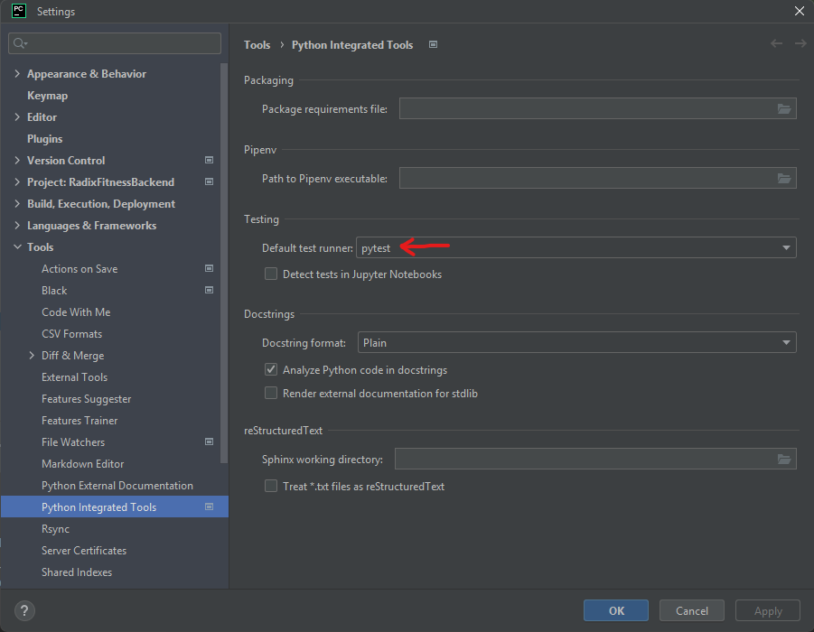
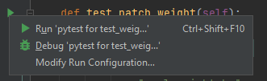

## Test File structure

The generated app will provide a `tests.py`, however, I much prefer to change the structure to the following,

```commandline
app_example/
  /tests/
    __init__.py
    test_models.py
    test_views.py
```

In order to not bloat the single file with every test type.

## Test Code Structure

Test cases will typically have a format such as this,

```python
class YourTestClass(TestCase):
    def setUp(self):
        # Setup run before every test method.
        pass

    def tearDown(self):
        # Clean up run after every test method.
        pass
    
    @classmethod
    def setUpTestData(cls):
        # Will be only ran once, to create reusable test data.
        pass

    def test_something_that_will_pass(self):
        self.assertFalse(False)

    def test_something_that_will_fail(self):
        self.assertTrue(False)
```

## Running Tests Using PyCharm

The dependency `pytest-django` is used to easily configure and run Django tests. This dependency is very useful as without it running tests directly using PyCharm is not possible without `pytest-django` as this dependency is responsible for calling `django.setup()` automatically which registering the apps.

<div align="center">
    
</div>

<div align="center">
    
</div>


The configuration for `pytest-django` is done in `pyproject.toml`


## Running All Tests Using CLI

To execute all tests, the following command can be used.

```commandline
python manage.py test
```

This will discover all files named with the pattern test*.py under the current directory and run all tests defined 
using appropriate base classes.

If your tests are independent, on a multiprocessor machine you can significantly speed them up by running them in 
parallel. The use of --parallel auto below runs one test process per available core. The auto is optional, and you can 
also specify a particular number of cores to use.

To speed up test execution, tests can be ran in paralle.

```commandline
python manage.py test --parallel auto
```